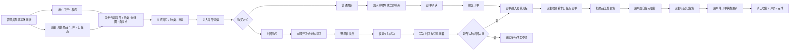

# 社区生鲜团购系统技术栈与流程总结

## 1. 三端技术栈

| 端 | 技术栈 | 主要实现 |
| --- | --- | --- |
| 普通用户端 | 原生微信小程序、WXML、WXSS、JavaScript、微信小程序 API、CloudBase 云开发 | 首页、分类、商品详情、搜索、购物车、订单确认、地址、拼团、订单、收藏、反馈、客服、个人中心等页面。核心状态与业务逻辑集中在 `utils/store.js`，支持 `wx.setStorageSync` 本地缓存、CloudBase 云数据库同步和 mock 数据兜底。 |
| 自提点店主端 | 同一个微信小程序内的多角色入口、原生小程序页面、`ownerApi` 云函数、CloudBase 云数据库 | 店主工作台、到店商品汇总、收货人列表、自提点设置。通过当前用户 `openid` 校验 `owner_bindings` 绑定关系，只允许店主访问自己绑定自提点的数据。 |
| 后台管理员端 | CloudBase 数据库/数据模型可视化后台、`adminApi` 云函数、管理员 openid 白名单 | 第一版不单独开发 Web 后台，使用 CloudBase 可视化能力维护商品、分类、轮播图、自提点、订单和店主绑定关系。`adminApi` 提供概览、列表查询、商品更新、轮播图更新、订单状态更新等兜底接口。 |

## 2. 公共基础技术

- 小程序框架：微信原生小程序，项目类型为 `miniprogram`，页面由 `.wxml`、`.wxss`、`.js`、`.json` 组成。
- UI 与交互：自定义底部导航组件 `components/tab-bar`，整体使用绿色生鲜主题。
- 云开发：`wx.cloud.init` 初始化 CloudBase 环境，云函数使用 Node.js 与 `wx-server-sdk`。
- 云函数：`getOpenId` 获取用户身份，`ownerApi` 处理店主端查询和提货状态变更，`adminApi` 处理后台管理兜底操作。
- 数据存储：CloudBase 云数据库作为正式数据源，本地 `wx.setStorageSync` 用于购物车、订单、拼团、收藏、地址、用户信息等演示缓存。
- 兜底数据：`utils/mock-data.js` 保留分类、商品、轮播图、自提点等 mock 数据，云端读取失败时仍能演示。
- 文件资源：当前包含本地图片资源和远程图片链接，正式版可迁移到 CloudBase 云存储。
- 支付方式：毕业设计演示版采用模拟支付成功流程；正式上线建议接入微信支付。

## 3. 主要数据集合

| 集合 | 用途 |
| --- | --- |
| `users` | 用户资料、角色、默认自提点等信息 |
| `admin_users` | 后台管理员 openid 白名单 |
| `owner_bindings` | 店主与自提点绑定关系 |
| `pickup_points` | 自提点名称、地址、营业时间、电话、公告、状态 |
| `categories` | 商品分类 |
| `products` | 商品名称、图片、价格、团购价、库存、上下架、推荐状态 |
| `banners` | 首页轮播图及跳转配置 |
| `orders` | 订单、联系人、自提点、金额、状态、商品快照 |
| `fresh_groups` | 拼团记录 |
| `fresh_group_members` | 拼团成员记录 |

## 4. 系统流程总结

1. 管理员先在 CloudBase 后台维护分类、商品、轮播图、自提点、店主绑定关系和基础订单数据。
2. 用户打开小程序后，系统初始化云开发环境，调用 `getOpenId` 获取当前微信用户身份，并尝试从云数据库同步商品、分类、轮播图、自提点和拼团数据。
3. 用户通过首页、分类页、搜索页进入商品详情，可以收藏商品、加入购物车、直接购买、立即开团或参与已有拼团。
4. 普通购买流程为：选择商品，加入购物车，进入订单确认，填写或读取收货信息，确认自提点，提交订单，订单进入待备货或后续状态。
5. 拼团流程为：用户在商品详情选择立即开团或参团，选择自提点，模拟支付成功后写入拼团和订单数据；当支付成员数达到成团人数后，拼团订单进入履约流程。
6. 店主登录后，系统通过 `ownerApi` 校验当前 `openid` 是否绑定自提点。校验通过后，店主可查看工作台、到店商品汇总和收货人列表。
7. 店主根据订单完成备货和现场提货，提货完成后在收货人列表中标记已提货，订单状态同步更新为待评价或已提货相关状态。
8. 管理员可通过 CloudBase 可视化后台或 `adminApi` 维护商品、轮播图、自提点、订单状态等数据，用户端和店主端读取最新配置。

## 5. 系统功能结构图

```mermaid
flowchart TB
  A["社区生鲜团购管理系统"]

  A --> U["普通用户端"]
  A --> O["自提点店主端"]
  A --> M["后台管理员端"]
  A --> B["公共基础层"]

  U --> U1["账号与个人中心"]
  U1 --> U11["微信登录 / openid"]
  U1 --> U12["地址管理"]
  U1 --> U13["收藏 / 客服 / 反馈"]

  U --> U2["商品浏览与选购"]
  U2 --> U21["首页轮播图"]
  U2 --> U22["商品分类"]
  U2 --> U23["商品搜索"]
  U2 --> U24["商品详情"]

  U --> U3["购物车与订单"]
  U3 --> U31["加入购物车"]
  U3 --> U32["数量调整 / 勾选 / 删除"]
  U3 --> U33["订单确认"]
  U3 --> U34["订单状态查询"]

  U --> U4["拼团功能"]
  U4 --> U41["查看团购价"]
  U4 --> U42["立即开团"]
  U4 --> U43["参与拼团"]
  U4 --> U44["邀请好友 / 成团流转"]

  U --> U5["自提流程"]
  U5 --> U51["选择自提点"]
  U5 --> U52["查看取货信息"]
  U5 --> U53["确认收货 / 评价"]

  O --> O1["店主身份校验"]
  O1 --> O11["openid 校验"]
  O1 --> O12["owner_bindings 绑定关系"]

  O --> O2["店主工作台"]
  O2 --> O21["今日订单统计"]
  O2 --> O22["待备货 / 待自提 / 已提货"]
  O2 --> O23["预计到店商品件数"]

  O --> O3["到店商品管理"]
  O3 --> O31["按商品汇总数量"]
  O3 --> O32["按订单状态筛选"]
  O3 --> O33["备货参考"]

  O --> O4["收货人管理"]
  O4 --> O41["收货人列表"]
  O4 --> O42["订单明细查询"]
  O4 --> O43["搜索姓名 / 手机号 / 订单号"]
  O4 --> O44["标记已提货"]

  O --> O5["自提点设置"]
  O5 --> O51["地址维护"]
  O5 --> O52["营业时间维护"]
  O5 --> O53["联系电话维护"]
  O5 --> O54["公告维护"]

  M --> M1["管理员权限校验"]
  M1 --> M11["ADMIN_OPENIDS"]
  M1 --> M12["admin_users 白名单"]

  M --> M2["内容配置管理"]
  M2 --> M21["轮播图管理"]
  M2 --> M22["分类管理"]
  M2 --> M23["商品管理"]
  M2 --> M24["推荐 / 上下架 / 价格 / 库存"]

  M --> M3["运营数据管理"]
  M3 --> M31["自提点管理"]
  M3 --> M32["店主绑定管理"]
  M3 --> M33["订单管理"]
  M3 --> M34["拼团管理"]

  B --> B1["微信原生小程序"]
  B --> B2["CloudBase 云数据库"]
  B --> B3["CloudBase 云函数"]
  B --> B4["CloudBase 云存储"]
  B --> B5["本地缓存与 mock 兜底"]
```

## 6. 核心业务流程图

